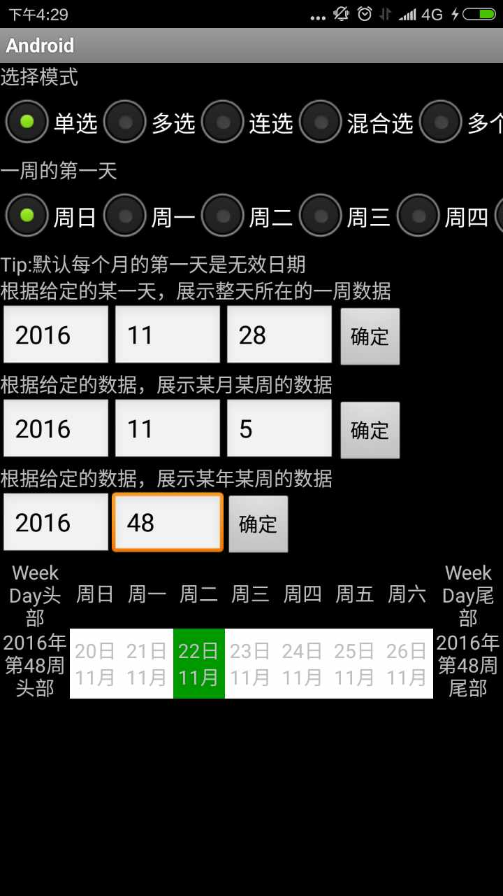

# Calendar
## 概述
+   该库是Android日历选择库，支持高度定制，包括UI/交互/选择策略等，非常灵活；
+   支持单选，多选，连选，混合选（开始和结束日期可以是同一天），多个连选，多个混合选；
+   支持设置一周第一天，日期数据也会随着改变，默认周日是一周的第一天；
+   支持多个ICalendarView之间数据（选择数据）同步；内部ICalendarView分为几类：单周
（WeekView），周历（WeekListView），月历（MonthListView）和年历（YearListView），
CalendarManager可以管理多个ICalendarView，做到数据（选择）同步；
+   支持上层定制UI，包括DayCell，周头部，周尾部，月头部，月尾部，年头部，年尾部
+   支持上层定制数据处理策略，内部针对每种选择模式，定义了一到两种选择处理策略（详见DayCellHandlePolicyImp)
+   支持交互定制（Click，LongClick，Touch等等），目前支持Click，LongClick两种，Touch感觉没有友好的交互方式，
暂不支持；

## 使用方法
1. 项目依赖

    ```
        'com.xing.android:CalendarPicker:1.0.0'
    ```
2. 代码使用
    ```
        //1.ICalendarManager创建
        ICalendarManager manager = new CalendarManager;
        //2.创建ICalendarView，可以通过findViewById，也可以new
        WeekView weekView = findViewById(id)
        WeekListView weekListView = findViewById(id)
        MonthListView monthListView = findViewById(id)
        YearListView yearListView = findViewById(id)
        //3.ICalendarManager和ICalendarView绑定，绑定到同一个ICalendarManager的ICalendarView，选择数据同步
        manager.addCalendarView(weekView);
        manager.addCalendarView(weekListView);
        manager.addCalendarView(monthListView);
        manager.addCalendarView(yearListView);
        //4.Operation
        //设置选择模式
        manager.getSelectMode(mode);
        //设置一周的第一天
        manager.setFirstDayOfWeek(firstDayOfWeek);
        //设置选择策略（根据具体的选择模式）
        manager.setXXXPolicy()
        //设置交互方式，包括Click和LongClick
        manager.getDayCellUserInterfaceInfo()
        //给DayCell绑定业务Data
        manager.setData()
    ```

## 页面展示
    内部有Demo页面，分别针对单周，周历，月历，年历，多个控件数据同步，垂直分页周历（扩展）和水平分页月历（扩展）

### 单周
    指定任意一天，展示该天所在的一周数据


    指定某年某月某周，展示该周数据


    指定某年某周，展示该周数据


### 周历
    指定任意一天，展示该天所在的周开始，任意周数的数据


### 月历
    指定某年某月，展示从该月开始，任意数月的数据


### 年历
    指定某年，展示从该年开始，任意年数的数据


### 多控件选择数据同步
    CalendarManager可以同时管理多个ICalendarView，ICalendarView之间数据同步


